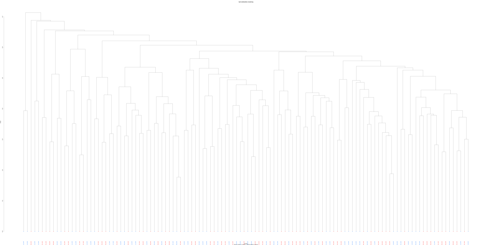

# RRBS analysis 

## test 
see [Bismark user guide](https://rawgit.com/FelixKrueger/Bismark/master/Docs/Bismark_User_Guide.html#appendix-iii-bismark-methylation-extracto) 

Import all the recquired dependencies (samtools, bamstool, cutadapt, fastqc... will be store in the PATH):  
`module load biokit`

set the PATH variables:  
`export PATH=$PATH:/scratch/project_2003846/test_bismark/Bismark-0.22.3/`  
`export PATH=$PATH:/scratch/project_2003846/test_bismark/Bismark-0.22.3/ `   
dont start the path by `users/servante`!

### quality control - fastQC
Quality control is done using FastQC, before the trimming to check the raw data. It identifies biases in base composition, read duplication, base quality, read length etc. and. 

`fastqc -o ./data/output_quality_raw/ ./data/test_data.fastq`

The output directory need to be created prior the fastqc! `mkdir quality_control_raw` 

It provides an htlm document in which to inspect the output, which contains: 

- **Basic stats**
- **Per base sequence quality**: ften, the quality of - especially very long - reads deteriorates towards later cycles.
- **Quality per tile**: Encoded in these is the flowcell tile from which each read came. The graph allows you to look at the quality scores from each tile across all of your bases to see if there was a loss in quality associated with only one part of the flowcell.
- **Per sequence quality scores**
- **Base composition plots**: allows to detect if the bisulfite conversion has worked. Typical BS- Seq experiments in mammals tend to have an average cytosine content of ~1-2% throughout the entire sequence length.
- **GC content**: adapter contamination can shift the GC profile to 40-60%, when it usually ranges between 20~30% in mammals, but this can usually be fixed by adapter trimming the sequence file.
- **Duplication levels and over-represented sequences**: [How PCR duplicates arise in next-generation sequencing](https://www.cureffi.org/2012/12/11/how-pcr-duplicates-arise-in-next-generation-sequencing/)


### trimming - TrimGalore
Trimming of raw reads is done to remove low quality segments (Phred score of 20 or lower) from reads prior to analysis and the 2 extra bases due to RRBS and the illumina adapters.

`for fastq in data/*.fastq trim_galore --rrbs --illumina -o ./trimmed_data --fastqc `

- `rrbs`: identifies adapters, removes another 2 bp from the 3' end of Read 1, and for paired-end libraries also the first 2 bp of Read 2 (o avoid that the filled-in cytosine position close to the second MspI site in a sequence is used for methylation calls). Sequences trimmed because of poor quality will not be shortened any further.
- `illumina`: trim the first 13bp of the illumina universal adapter.
- `fastqc`: check the quality on the trimmed sequences just as previously with the raw data

Use the trimmed data for the further steps. 


### Bismark

#### genome prep
The genome of interest needs to be bisulfite converted in-silico and indexed.
C->T and G->A transformations on the reference genome:   
`bismark_genome_preparation ./path-to/reference-genome/`  
The bisulfite genome index needs to be generated only once and can be used for all subsequent bisulfite alignments with Bismark.


#### genome alignment
bismark aligns the reads for both transformed and untransformed reference genomes which were created in the genome preparation step
`bismark -q --un --ambiguous -o ./Bismark_output data/refgen/ trimmed/test_data_trimmed.fq/`

- `q`: when the input are fastq or fq files
- `--un`: Write all reads that could not be aligned to the file _unmapped_reads.fq.gz in the output directory.
- `-- ambiguous`: Write all reads which produce more than one valid alignment with the same number of lowest mismatches or other reads that fail to align uniquely to _ambiguous_reads.fq

This will produce 2 files: 1 report, and 1 `test_dataset_bismark_bt2.bam`

#### Extract methylated sites 
Extracts the methylation call for every single C analysed. The position of every single C will be written out to a new output file, depending on its context (CpG, CHG or CHH), whereby methylated Cs will be labelled as forward reads (+), non-methylated Cs as reverse reads (-)

```unix
bismark_methylation_extractor 
				-s 
				--bedGraph
				--counts 
				--cytosine_report 
				--zero_based 
				--genome_folder ./path-to/reference-genome/
				--output ./path-to/output-directory/
				./path-to/input.bam
```

- `s`: single-end read data
- `--bedGraph`: After finishing the methylation extraction, the methylation output is written into a sorted bedGraph file that reports the position of a given cytosine and its methylation state. By default, only cytosines in CpG context are sorted.
- `--cytosine_report`: produces a genome-wide methylation report for all cytosines in the genome.
- `--zero_based `: Uses 0-based genomic coordinates instead of 1-based coordinates. Default: OFF.


-----------------------------------


## Test on Suvi's data 

### RRBS analysis loop 
- `data` = a folder containing rrbs fastq files such as: "200022\_81\_B1_0\_S1\_L002\_R1\_001.fastq" 
- `ls data > samples_raw` will put all the files name contained in data in a .txt file `samples_raw`.
- `sed 's/......$//' samples_raw > samples` will delete the 6 last caracters of each line (".fastq"), and redirect the output into a txt file `samples`.
- loop syntax:
 
see script.

```bash
for sample in `cat sample.txt`
do 
	[commands]
done
```
#### Get files ready  

- copied the ctrl files to `eu_test/data`: `cp {200022_FFGC_ctrl_p1_S21_L001_R1_001,200022_FFGC_ctrl_p2_S42_L002_R1_001,200022_FFGC_ctrl_p3_S21_L001_R1_001,200022_FFGC_ctrl_p4_S42_L002_R1_001,200022_FFGC_ctrl_p5_S21_L001_R1_001,200022_FFGC_ctrl_p5_S21_L002_R1_001}.fastq.gz eu_test/data`
- unzip all .gz files in folder: `gzip -d *.gz`
- drag and drop the shell script to filezilla
- download japanese quail ref genome with `wget https://ftp.ncbi.nlm.nih.gov/genomes/all/GCF/001/577/835/GCF_001577835.2_Coturnix_japonica_2.1/GCF_001577835.2_Coturnix_japonica_2.1_genomic.fna.gz`
- unzip with `gzip -d` 
- Change .fna to .fa

Re run the `genome_preparation` for others analysis is not necesseray once it has been done: `cp -r refgen path/to/newdir`


#### Memory and time allocated for 2 samples

`seff` for 2 samples, with no `genome_preparation`: 4.30 GB used. Ran for 04:09 hours. The 2 samples size were 5,5Gb + 5,5Gb = 11Gb. 

```
[servante@puhti-login2 ~]$ seff 4596077
perl: warning: Setting locale failed.
perl: warning: Please check that your locale settings:
	LANGUAGE = (unset),
	LC_ALL = (unset),
	LC_CTYPE = "UTF-8",
	LANG = "en_US.UTF-8"
    are supported and installed on your system.
perl: warning: Falling back to the standard locale ("C").
Job ID: 4596077
Cluster: puhti
User/Group: servante/servante
State: FAILED (exit code 29)
Nodes: 1
Cores per node: 5
CPU Utilized: 07:38:43
CPU Efficiency: 44.88% of 17:02:10 core-walltime
Job Wall-clock time: 03:24:26
Memory Utilized: 3.09 GB
Memory Efficiency: 12.35% of 25.00 GB
Job consumed 25.55 CSC billing units based on following used resources
Billed project: project_2003821
CPU BU: 17.04
Mem BU: 8.52
```
```
[servante@puhti-login1 ~]$ seff 4599256
perl: warning: Setting locale failed.
perl: warning: Please check that your locale settings:
	LANGUAGE = (unset),
	LC_ALL = (unset),
	LC_CTYPE = "UTF-8",
	LANG = "en_US.UTF-8"
    are supported and installed on your system.
perl: warning: Falling back to the standard locale ("C").
Job ID: 4599256
Cluster: puhti
User/Group: servante/servante
State: COMPLETED (exit code 0)
Nodes: 1
Cores per node: 5
CPU Utilized: 01:18:10
CPU Efficiency: 35.10% of 03:42:40 core-walltime
Job Wall-clock time: 00:44:32
Memory Utilized: 1.19 GB
Memory Efficiency: 5.95% of 20.00 GB
Job consumed 5.20 CSC billing units based on following used resources
Billed project: project_2003821
CPU BU: 3.71
Mem BU: 1.48 
```


#### Do the analysis on the subset data without specifying the samples we are working on

- Each subset directory follow the same organisation: 

```
- 1_12_G
	- data_1_12_G
- 1_7_G
	- data_1_7_G
- ...
- refgen

```

- This script allows to store the last component of the working directory path into the variable `x`. See [full script](./RRBS_analysis_RGQMA1.sh).

```
export a=`pwd`
export b=`basename $a`
export x=_$b
```

- `${x}` will then give back the last working directory path component: `echo data_${x}` print `data_1_12_G` when in the `1_12_G` directory. 

- Before running the script on all of the subsets, unzip all by `find . -name "*fastq.gz" -exec gzip -d {} \;`

#### Time used to run bismark on the data 
I used 3GB per core, but 1 is largely sufficient.

```
  JobID  Partition      NCPUS   NTasks      State     ReqMem  SystemCPU     MaxRSS    Elapsed 
------------ ---------- ---------- -------- ---------- ---------- ---------- ---------- ---------- 
4648497           small          5           COMPLETED        3Gc   02:46:17              16:03:28 
4648497.bat+                     5        1  COMPLETED        3Gc   02:46:17   3237914K   16:03:28 
4648497.ext+                     5        1  COMPLETED        3Gc   00:00:00       113K   16:03:28 
4648498           small          5           COMPLETED        3Gc   03:41:10              21:13:55 
4648498.bat+                     5        1  COMPLETED        3Gc   03:41:10   3237783K   21:13:55 
4648498.ext+                     5        1  COMPLETED        3Gc   00:00:00       120K   21:13:55 
4648499           small          5           COMPLETED        3Gc   04:33:41            1-00:37:09 
4648499.bat+                     5        1  COMPLETED        3Gc   04:33:41   3237750K 1-00:37:09 
4648499.ext+                     5        1  COMPLETED        3Gc   00:00:00       107K 1-00:37:09 
4648500           small          5           COMPLETED        3Gc   03:50:16              21:52:16 
4648500.bat+                     5        1  COMPLETED        3Gc   03:50:16   3238091K   21:52:16 
4648500.ext+                     5        1  COMPLETED        3Gc   00:00:00       116K   21:52:16 
4648501           small          5           COMPLETED        3Gc   03:39:59              19:48:08 
4648501.bat+                     5        1  COMPLETED        3Gc   03:39:59   3237750K   19:48:08 
4648501.ext+                     5        1  COMPLETED        3Gc   00:00:00       103K   19:48:08 
4648502           small          5           COMPLETED        3Gc   03:34:28              21:02:19 
4648502.bat+                     5        1  COMPLETED        3Gc   03:34:28   3237854K   21:02:19 
4648502.ext+                     5        1  COMPLETED        3Gc   00:00:00       112K   21:02:19 
4648503           small          5           COMPLETED        3Gc   03:22:10              22:31:28 
4648503.bat+                     5        1  COMPLETED        3Gc   03:22:10   3237908K   22:31:28 
4648503.ext+                     5        1  COMPLETED        3Gc   00:00:00       117K   22:31:28 
4648504           small          5           COMPLETED        3Gc   03:46:56              21:59:14 
4648504.bat+                     5        1  COMPLETED        3Gc   03:46:56   3237688K   21:59:14 
4648504.ext+                     5        1  COMPLETED        3Gc   00:00:00       110K   21:59:14 
4648505           small          5           COMPLETED        3Gc   03:02:40              18:17:48 
4648505.bat+                     5        1  COMPLETED        3Gc   03:02:40   3237802K   18:17:48 
4648505.ext+                     5        1  COMPLETED        3Gc   00:00:00       115K   18:17:48 
4648506           small          5           COMPLETED        3Gc   04:03:24              23:18:08 
4648506.bat+                     5        1  COMPLETED        3Gc   04:03:24   3237823K   23:18:08 
4648506.ext+                     5        1  COMPLETED        3Gc   00:00:00       118K   23:18:08 
4648507           small          5           COMPLETED        3Gc   03:46:20              22:58:43 
4648507.bat+                     5        1  COMPLETED        3Gc   03:46:20   3238019K   22:58:43 
4648507.ext+                     5        1  COMPLETED        3Gc   00:00:00       110K   22:58:43 
4648508           small          5           COMPLETED        3Gc   03:28:25              21:36:26 
4648508.bat+                     5        1  COMPLETED        3Gc   03:28:25   3237651K   21:36:26 
4648508.ext+                     5        1  COMPLETED        3Gc   00:00:00       110K   21:36:26 
4648509           small          5           COMPLETED        3Gc   02:51:52              19:37:44 
4648509.bat+                     5        1  COMPLETED        3Gc   02:51:52   3237642K   19:37:44 
4648509.ext+                     5        1  COMPLETED        3Gc   00:00:00       116K   19:37:44 
4648510           small          5           COMPLETED        3Gc   03:12:45              21:23:50 
4648510.bat+                     5        1  COMPLETED        3Gc   03:12:45   3237518K   21:23:50 
4648510.ext+                     5        1  COMPLETED        3Gc   00:00:00        94K   21:23:50 
4648511           small          5           COMPLETED        3Gc   03:37:41              22:36:38 
4648511.bat+                     5        1  COMPLETED        3Gc   03:37:41   3237838K   22:36:38 
4648511.ext+                     5        1  COMPLETED        3Gc   00:00:00       108K   22:36:38 
```


### The Bismark HTML Processing Report

### multiqc 
Gives a nice [html report](./multiqc_report.html) of bismark outputs

- activate the venv where multiqc is installed: `source /scratch/project_2003821/RGQMA/my_venv/bin/activate`
- Resolve the UTF8 problem by `export LC_ALL=en_US.utf8` & `export LANG=en_US.utf8` 

Everything seems normal, accordind to the [multiqc html report](./multiqc_report.html). A high duplication level is normal. 

## methylKit 
methylKit is an R package for analysis and annotation of DNA methylation information obtained by high-throughput bisulfite sequencing. See [user guide](https://bioconductor.org/packages/release/bioc/vignettes/methylKit/inst/doc/methylKit.html#22_Reading_the_methylation_call_files_and_store_them_as_flat_file_database)

### Data preparation 
- First I need to get all the `zero.cov` files in the `meth` directories (the methylation extraction output directory), and store their names and all associated information (batch number, age, control or glyphosate) in a tab file for later use in methylKit. See the script to do that [here](./cov_tab.sh). I get a tab file (sampleID.csv) with `<name>	<cond>	<age>` and added a last column `<batch>` through Numbers.

The coverage output looks like this:
`<chromosome> <start position> <end position> <methylation percentage> <count methylated> <count unmethylated>`

- File names and samples ID must be different
	- I used the function TEXTBETWEEN in Numbers to get rid of the identical left and right parts of each file names, and saved the file as csv for later use in R. Now the csv file is composed of 5 colums `<file>	<cond>	<age>	<name>	<sex>`.
	- To add the sex of each samples in my csv, using Suvi's excel sheet, see [script](nameToSex).


### See Rscript.

### Workflow summary
See Rscript  

1. **Basic**
	1. Read the methylation call (.cov files obtained through bismark methylation extraction) and make a db 

	2. Filtering samples based on read coverage: discard base with low coverage, to get rid of PCR mistakes, but also discard bases with very high coverage that could result from PCR bias. 

2. **Comparative analysis**
	1. Merge all samples for futher analysis: a new object is built containing methylation information for regions/bases that are covered in all samples
	
	2. A look at **correlation between samples** 

	
	3. **Clustering samples** 
	
		
	4. **PCA analysis** on samples (see `PCA_screeplot_12_7.pdf`, 
	`PCA_scatter_plot_12_7.pdf`,`PCA_meth_plot.pdf`). PCA is an unsupervised method used to explore the data variance structure by reducing its dimensions to a few principal components (PC) that explain the greatest variation in the data.
	
	

	5. **Batch effect**: check which one of the principal components are statistically associated with a potential batch effects. Can also be used to see if an other variable has an effect on the methylation.

	
	6. **Finding differentially methylated bases or regions**: it will either use Fisher’s exact or logistic regression to calculate P-values.
	
``` 
methylDiffDB object with 192413 rows
--------------
          chr start  end strand       pvalue       qvalue  meth.diff
1 NC_029516.1  2468 2469      * 9.834917e-03 2.571624e-02  1.9994429
2 NC_029516.1  2474 2475      * 9.390694e-04 3.274655e-03  3.2129751
3 NC_029516.1  2477 2478      * 5.251947e-01 4.856084e-01  0.4167421
4 NC_029516.1  2501 2502      * 2.457894e-05 1.174618e-04  4.1993150
5 NC_029516.1  2538 2539      * 6.087399e-11 6.325995e-10  7.8738058
6 NC_029516.1  5715 5716      * 2.645256e-01 3.176008e-01 -0.4487316
--------------
sample.ids: 1_0_B10_S1_L001 10_B9_B10_S10_L001 100_69B_S20_L001 100_69B_S20_L002 11_22B_S11_L001 12_27B_S12_L001 13_34B_S13_L001 14_38B_S14_L001 15_40B_S15_L001 16_64B_S16_L001 17_67B_S17_L001 18_70B_S18_L001 19_71B_S19_L001 2_0_B2_S2_L001 20_8B_S20_L001 21_0_B5_S22_L002 22_0_B6_S23_L002 23_0_G5_S24_L002 24_0_G6_S25_L002 25_0_M6_S26_L002 26_0_R10_S27_L002 27_0_R2_S28_L002 28_0_R3_S29_L002 29_G4_0_S30_L002 3_0_B3_S3_L001 30_G6_0_S31_L002 31_12B_S32_L002 32_21B_S33_L002 33_31B_S34_L002 34_32B_S35_L002 35_39B_S36_L002 36_48B_S37_L002 37_50B_S38_L002 38_54B_S39_L002 39_59B_S40_L002 4_0_B4_S4_L001 40_73B_S41_L002 41_0_B8_S1_L001 42_0_G1_S2_L001 43_0_M3_S3_L001 44_0_M7_S4_L001 45_0_R4_S5_L001 46_0_R6_S6_L001 47_B5_0_S7_L001 48_B9_0_S8_L001 49_G8_0_S9_L001 5_0_G4_S5_L001 50_R1_R2_S10_L001 51_14B_S11_L001 52_18B_S12_L001 53_26B_S13_L001 54_28B_S14_L001 55_29B_S15_L001 56_47B_S16_L001 57_49B_S17_L001 58_52B_S18_L001 59_62B_S19_L001 6_0_M10_S6_L001 60_74B_S20_L001 61_0_G9_S22_L002 62_0_M4_S23_L002 63_0_M8_S24_L002 64_0_M9_S25_L002 65_0_R7_S26_L002 66_0_R8_S27_L002 67_G1_0_S28_L002 68_G2_0_S29_L002 69_G3_G4_S30_L002 7_0_M2_S7_L001 70_R3_R4_S31_L002 71_10B_S32_L002 72_13B_S33_L002 73_24B_S34_L002 74_30B_S35_L002 75_35B_S36_L002 76_61B_S37_L002 77_63B_S38_L002 78_65B_S39_L002 79_68B_S40_L002 8_0_M5_S8_L001 80_72B_S41_L002 81_B1_0_S1_L001 81_B1_0_S1_L002 82_B2_0_S2_L001 82_B2_0_S2_L002 83_B3_0_S3_L001 83_B3_0_S3_L002 84_B6_0_S4_L001 84_B6_0_S4_L002 85_B7_B8_S5_L001 85_B7_B8_S5_L002 86_G1_G2_S6_L001 86_G1_G2_S6_L002 87_G9_G10_S7_L001 87_G9_G10_S7_L002 88_M1_M2_S8_L001 88_M1_M2_S8_L002 89_M9_M10_S9_L001 89_M9_M10_S9_L002 9_B8_0_S9_L001 90_R9_R10_S10_L001 90_R9_R10_S10_L002 91_33B_S11_L001 91_33B_S11_L002 92_37B_S12_L001 92_37B_S12_L002 93_3B_S13_L001 93_3B_S13_L002 94_41B_S14_L001 94_41B_S14_L002 95_45B_S15_L001 95_45B_S15_L002 96_4B_S16_L001 96_4B_S16_L002 97_51B_S17_L001 97_51B_S17_L002 98_58B_S18_L001 98_58B_S18_L002 99_5B_S19_L001 99_5B_S19_L002 
destranded FALSE 
assembly: Coturnix_japonica_2.1 
context: CpG 
treament: 1 1 0 0 0 0 0 0 0 0 0 0 0 1 0 1 1 1 1 1 1 1 1 1 1 1 0 0 0 0 0 0 0 0 0 1 0 1 1 1 1 1 1 1 1 1 1 1 0 0 0 0 0 0 0 0 0 1 0 1 1 1 1 1 1 1 1 1 1 1 0 0 0 0 0 0 0 0 0 1 0 1 1 1 1 1 1 1 1 1 1 1 1 1 1 1 1 1 1 1 1 1 0 0 0 0 0 0 0 0 0 0 0 0 0 0 0 0 0 0 
resolution: base 
dbtype: tabix 
```

```
$diffMeth.per.chr
              chr number.of.hypermethylated percentage.of.hypermethylated number.of.hypomethylated percentage.of.hypomethylated
1     NC_029516.1                        32                   0.164642931                        0                   0.00000000
2     NC_029517.1                         1                   0.006248047                        3                   0.01874414
3     NC_029519.1                         1                   0.007017544                        0                   0.00000000
4     NC_029522.1                         4                   0.051499936                        5                   0.06437492
5     NC_029523.1                         2                   0.026571011                        0                   0.00000000
6     NC_029525.1                         4                   0.056617127                        0                   0.00000000
7     NC_029527.1                         0                   0.000000000                        5                   0.08539710
8     NC_029528.1                        14                   0.256175663                        0                   0.00000000
9     NC_029529.1                         4                   0.075301205                        5                   0.09412651
10    NC_029530.1                         1                   0.021404110                        0                   0.00000000
11    NC_029533.1                         0                   0.000000000                        2                   0.05317735
12    NC_029534.1                         0                   0.000000000                        7                   0.15015015
13    NC_029537.1                         0                   0.000000000                        2                   0.12861736
14    NC_029542.1                         3                   0.067415730                        0                   0.00000000
15 NW_015440339.1                         1                  14.285714286                        0                   0.00000000

$diffMeth.all
  number.of.hypermethylated percentage.of.hypermethylated number.of.hypomethylated percentage.of.hypomethylated
1                        67                    0.03482093                       29                   0.01507175
```
	
3. **Annotating differentially methylated regions/bases based on gene annotation:** the gene annotations can be read for a bed12 file. A GFF3 can be convert to a bed12 with the two scripts gtfToGenePred and genePredToBed from <http://hgdownload.cse.ucsc.edu/admin/exe/linux.x86_64/>. See [notes](<https://hgdownload.soe.ucsc.edu/downloads.html>) about 'permission denied' error


``` 
Summary of target set annotation with genic parts
Rows in target set: 358
-----------------------
percentage of target features overlapping with annotation:
  promoter       exon     intron intergenic 
     40.50      40.50      48.88      12.57 

percentage of target features overlapping with annotation:
(with promoter > exon > intron precedence):
  promoter       exon     intron intergenic 
     40.50      19.27      27.65      12.57 

percentage of annotation boundaries with feature overlap:
promoter     exon   intron 
    0.13     0.01     0.03 

summary of distances to the nearest TSS:
   Min. 1st Qu.  Median    Mean 3rd Qu.    Max. 
    0.0   480.2  1225.5  5475.2  3526.5 84672.0 
```

```
  CpGi shores  other 
 83.80  10.61   5.59 
  CpGi shores 
  0.58   0.06 
```

 


