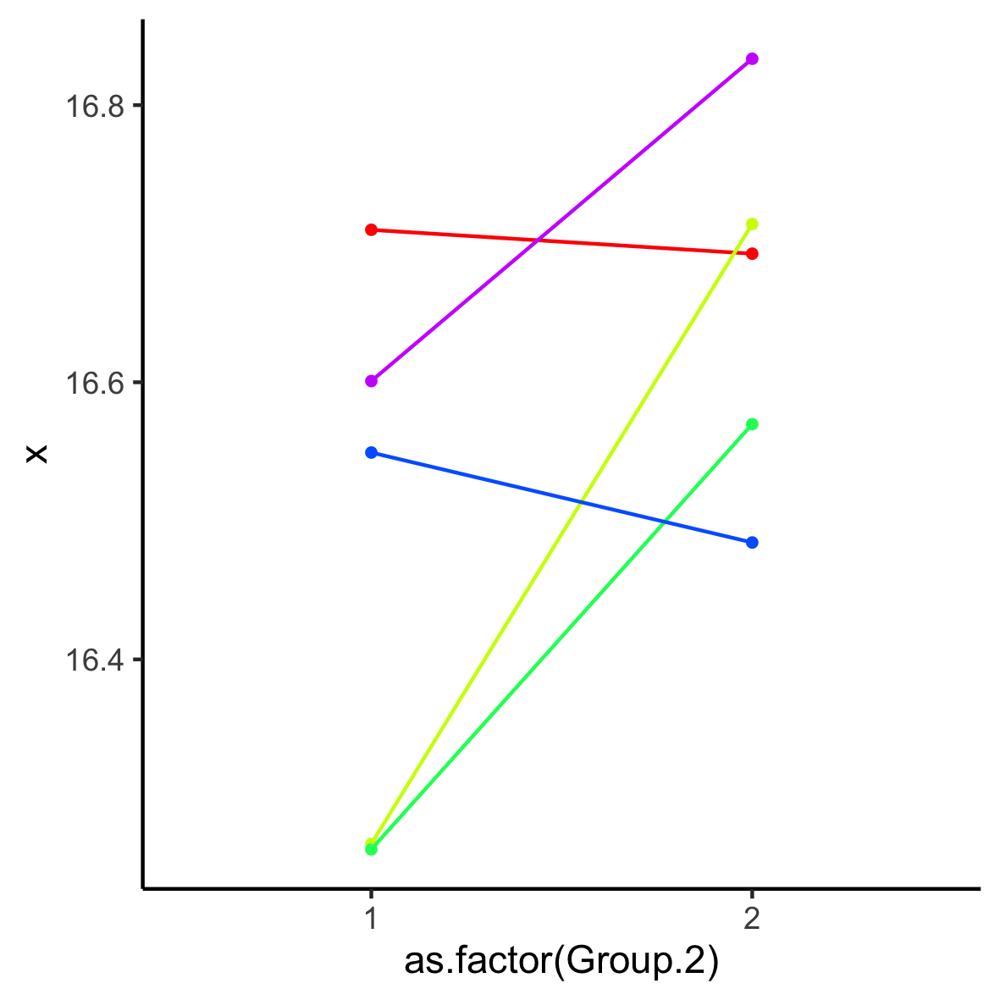
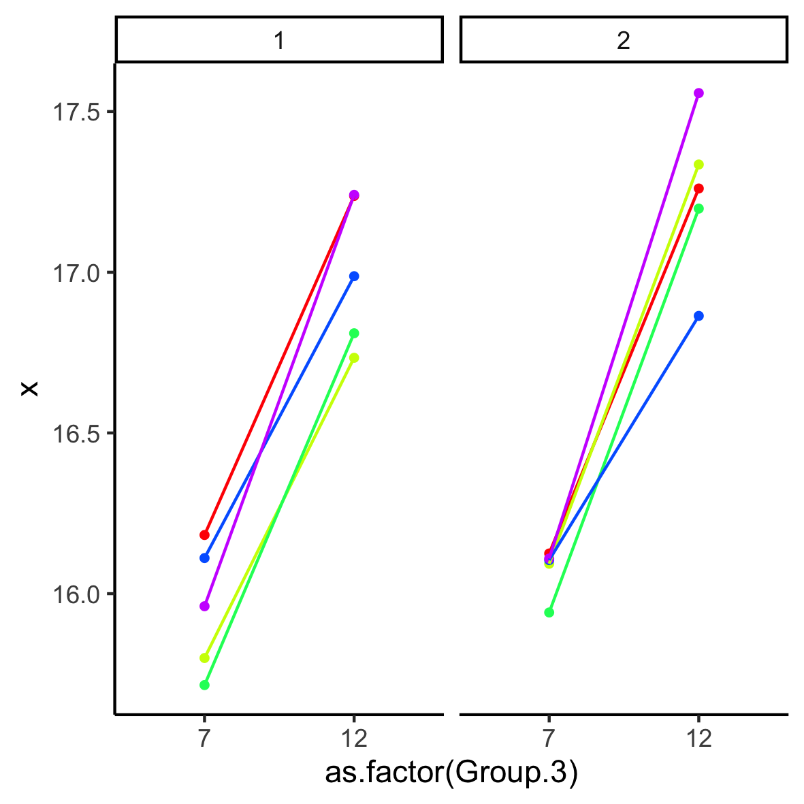

# Data plotting
### The mean methylation % per sites 
- top left: age=7, treatment=control 
- bottom left: age=7, treatment=glyphosate 
- top right: age=12, treatment=control 
- bottom right: age=12, treatment=glyphosate 
 

### The mean methylation per batch and condition (1 = control, 2 = glyphosate)

### The mean methylation per batch and age, per condition (1 = control, 2 = glyphosate)

