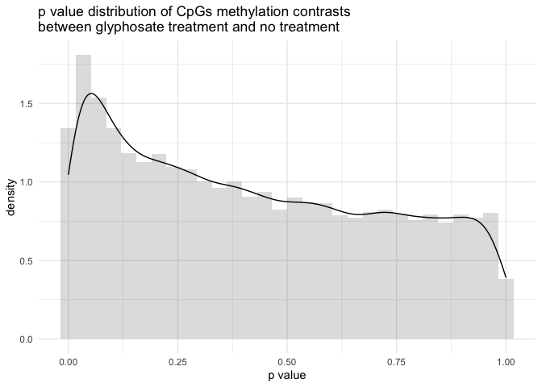
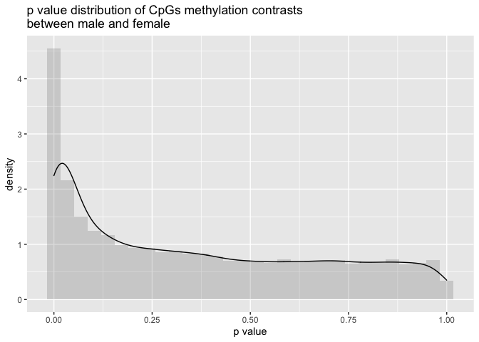
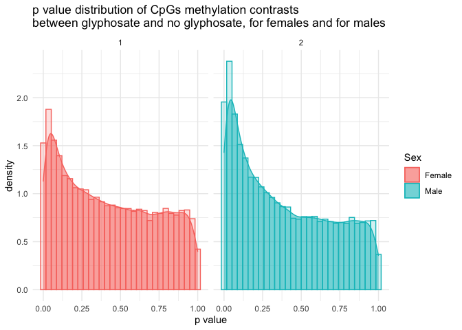

results from pipeline12
================
Euphrasie
07/04/2021

## Pre steps

### Data preparation

See [dataprep.R](./dataprep.R) for the handling of the methylation data
from the .cov files, and [lme4\_dataprep.md](./lme4_dataprep.md) to
switch methylation dataframes from “wide” to “long”.  
For the filtering of sites that have at least 5% differences in pairwise
comparison among the differents sex/age/cond groups, see
[filtering.R](./filtering.R)

## Pipeline

See [pipeline12.R](./pipeline12.R) The ONLY thing changing from
pipeline7 is

``` r
meth_unmeth12 = subset(meth_unmeth, meth_unmeth$age==12)
```

## Results

### warnings

How the fittings went:

##### GlyphEffect warnings

    ## [1] "there were 353 warnings"

    ## [1] "of which 82 were: 'boundary (singular) fit: see ?isSingular'"

    ## [1] "8 were: 'unable to evaluate scaled gradient'"

    ## [1] "263 were: 'Model failed to converge with max|grad| = x (tol = 0.002, component 1)'"

##### SexEffect warnings

    ## [1] "there were 352 warnings"

    ## [1] "of which 104 were: 'boundary (singular) fit: see ?isSingular'"

    ## [1] "3 were: 'unable to evaluate scaled gradient'"

    ## [1] "245 were: 'Model failed to converge with max|grad| = x (tol = 0.002, component 1)'"

##### Full warnings

    ## [1] "Full: there were 477 warnings"

    ## [1] "of which 195 were: 'boundary (singular) fit: see ?isSingular'"

    ## [1] "15 were: 'unable to evaluate scaled gradient'"

    ## [1] "267 were: 'Model failed to converge with max|grad| = x (tol = 0.002, component 1)'"

### differentially methylated sites

After keeping only sites with a p value &lt;= 0.05 in at least one of
the models fitted, there are

    ## [1] "8781differentially methylated sites"

How many sites are differentialy methylated, based on the model fitted:

    ## [1] "Full model (sexF~cond) 2287"

    ## [1] "Full model (sexM~cond) 2937"

    ## [1] "GlyphEffect: 2130"

    ## [1] "SexEffect: 4580"

How many of them appears also differentialy methylated fitted by another
model:
<table class="table table-striped table-hover" style="margin-left: auto; margin-right: auto;">
<thead>
<tr>
<th style="text-align:left;">
</th>
<th style="text-align:right;">
Glyph
</th>
<th style="text-align:right;">
Sex
</th>
<th style="text-align:right;">
Full F
</th>
<th style="text-align:right;">
Full M
</th>
<th style="text-align:right;">
Full F&M
</th>
<th style="text-align:right;">
all
</th>
</tr>
</thead>
<tbody>
<tr>
<td style="text-align:left;">
Glyph
</td>
<td style="text-align:right;">
2130
</td>
<td style="text-align:right;">
380
</td>
<td style="text-align:right;">
791
</td>
<td style="text-align:right;">
882
</td>
<td style="text-align:right;">
119
</td>
<td style="text-align:right;">
16
</td>
</tr>
<tr>
<td style="text-align:left;">
Sex
</td>
<td style="text-align:right;">
380
</td>
<td style="text-align:right;">
4580
</td>
<td style="text-align:right;">
534
</td>
<td style="text-align:right;">
718
</td>
<td style="text-align:right;">
70
</td>
<td style="text-align:right;">
16
</td>
</tr>
<tr>
<td style="text-align:left;">
Full F
</td>
<td style="text-align:right;">
791
</td>
<td style="text-align:right;">
534
</td>
<td style="text-align:right;">
2287
</td>
<td style="text-align:right;">
318
</td>
<td style="text-align:right;">
2287
</td>
<td style="text-align:right;">
16
</td>
</tr>
<tr>
<td style="text-align:left;">
Full M
</td>
<td style="text-align:right;">
882
</td>
<td style="text-align:right;">
718
</td>
<td style="text-align:right;">
318
</td>
<td style="text-align:right;">
2937
</td>
<td style="text-align:right;">
2937
</td>
<td style="text-align:right;">
16
</td>
</tr>
<tr>
<td style="text-align:left;">
Full F&M
</td>
<td style="text-align:right;">
119
</td>
<td style="text-align:right;">
70
</td>
<td style="text-align:right;">
2287
</td>
<td style="text-align:right;">
2937
</td>
<td style="text-align:right;">
2937
</td>
<td style="text-align:right;">
16
</td>
</tr>
</tbody>
</table>

### p value distribution

<!-- -->

<!-- -->

<!-- -->
