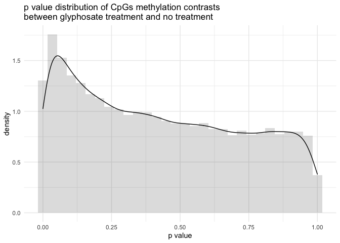
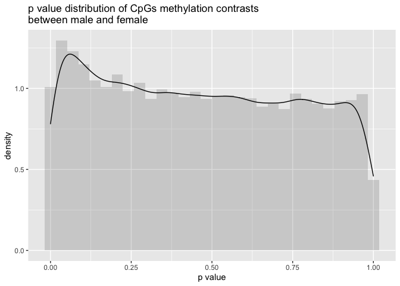
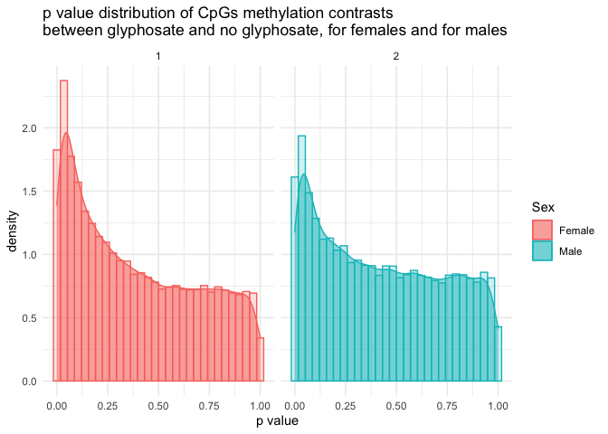

results from pipeline7
================
Euphrasie
3/15/2021

## Pre steps

### Data preparation

See [dataprep.R](./dataprep.R) for the handling of the methylation data
from the .cov files, and [lme4\_dataprep.md](./lme4_dataprep.md) to
switch methylation dataframes from “wide” to “long”.  
For the filtering of sites that have at least 5% differences in pairwise
comparison among the differents sex/age/cond groups, see
[filtering.R](./filtering.R)

## Pipeline

See [pipeline.R](./pipeline.R)

## Results

### warnings

How the fittings went:

##### GlyphEffect warnings

    ## [1] "there were 424 warnings"

    ## [1] "of which 130 were: 'boundary (singular) fit: see ?isSingular'"

    ## [1] "3 were: 'unable to evaluate scaled gradient'"

    ## [1] "291 were: 'Model failed to converge with max|grad| = x (tol = 0.002, component 1)'"

##### SexEffect warnings

    ## [1] "there were 391 warnings"

    ## [1] "of which 117 were: 'boundary (singular) fit: see ?isSingular'"

    ## [1] "2 were: 'unable to evaluate scaled gradient'"

    ## [1] "272 were: 'Model failed to converge with max|grad| = x (tol = 0.002, component 1)'"

##### Full warnings

    ## [1] "Full: there were 513 warnings"

    ## [1] "of which 188 were: 'boundary (singular) fit: see ?isSingular'"

    ## [1] "20 were: 'unable to evaluate scaled gradient'"

    ## [1] "305 were: 'Model failed to converge with max|grad| = x (tol = 0.002, component 1)'"

### differentially methylated sites

After keeping only sites with a p value &lt;= 0.05 in at least one of
the models fitted, there are

    ## [1] "7267 sites"

These sites also contains sites with `p.value == 0`. These sites results
from fittings that did not converged.  
After removing these sites, there are

    ## [1] "7267 differentially methylated sites"

How many sites are differentialy methylated, based on the model fitted:

    ## [1] "Full model (sexF~cond) 3115"

    ## [1] "Full model (sexM~cond) 2636"

    ## [1] "GlyphEffect: 2279"

    ## [1] "SexEffect: 1714"

How many of them appears also differentialy methylated fitted by another
model:
<table class="table table-striped table-hover" style="margin-left: auto; margin-right: auto;">
<thead>
<tr>
<th style="text-align:left;">
</th>
<th style="text-align:right;">
Glyph
</th>
<th style="text-align:right;">
Sex
</th>
<th style="text-align:right;">
Full F
</th>
<th style="text-align:right;">
Full M
</th>
<th style="text-align:right;">
Full F&M
</th>
<th style="text-align:right;">
all
</th>
</tr>
</thead>
<tbody>
<tr>
<td style="text-align:left;">
Glyph
</td>
<td style="text-align:right;">
2279
</td>
<td style="text-align:right;">
162
</td>
<td style="text-align:right;">
835
</td>
<td style="text-align:right;">
984
</td>
<td style="text-align:right;">
112
</td>
<td style="text-align:right;">
9
</td>
</tr>
<tr>
<td style="text-align:left;">
Sex
</td>
<td style="text-align:right;">
162
</td>
<td style="text-align:right;">
1714
</td>
<td style="text-align:right;">
258
</td>
<td style="text-align:right;">
188
</td>
<td style="text-align:right;">
26
</td>
<td style="text-align:right;">
9
</td>
</tr>
<tr>
<td style="text-align:left;">
Full F
</td>
<td style="text-align:right;">
835
</td>
<td style="text-align:right;">
258
</td>
<td style="text-align:right;">
3115
</td>
<td style="text-align:right;">
308
</td>
<td style="text-align:right;">
3115
</td>
<td style="text-align:right;">
9
</td>
</tr>
<tr>
<td style="text-align:left;">
Full M
</td>
<td style="text-align:right;">
984
</td>
<td style="text-align:right;">
188
</td>
<td style="text-align:right;">
308
</td>
<td style="text-align:right;">
2636
</td>
<td style="text-align:right;">
2636
</td>
<td style="text-align:right;">
9
</td>
</tr>
<tr>
<td style="text-align:left;">
Full F&M
</td>
<td style="text-align:right;">
112
</td>
<td style="text-align:right;">
26
</td>
<td style="text-align:right;">
3115
</td>
<td style="text-align:right;">
2636
</td>
<td style="text-align:right;">
2636
</td>
<td style="text-align:right;">
9
</td>
</tr>
</tbody>
</table>

### p value distribution

<!-- -->

<!-- -->

<!-- -->
