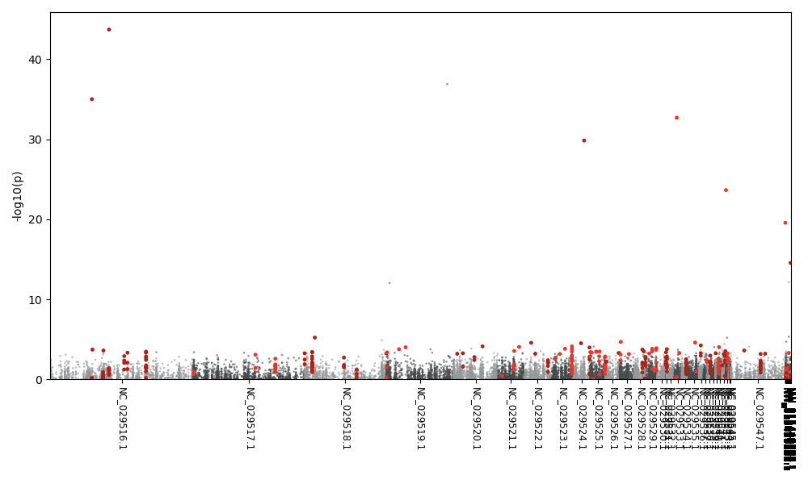
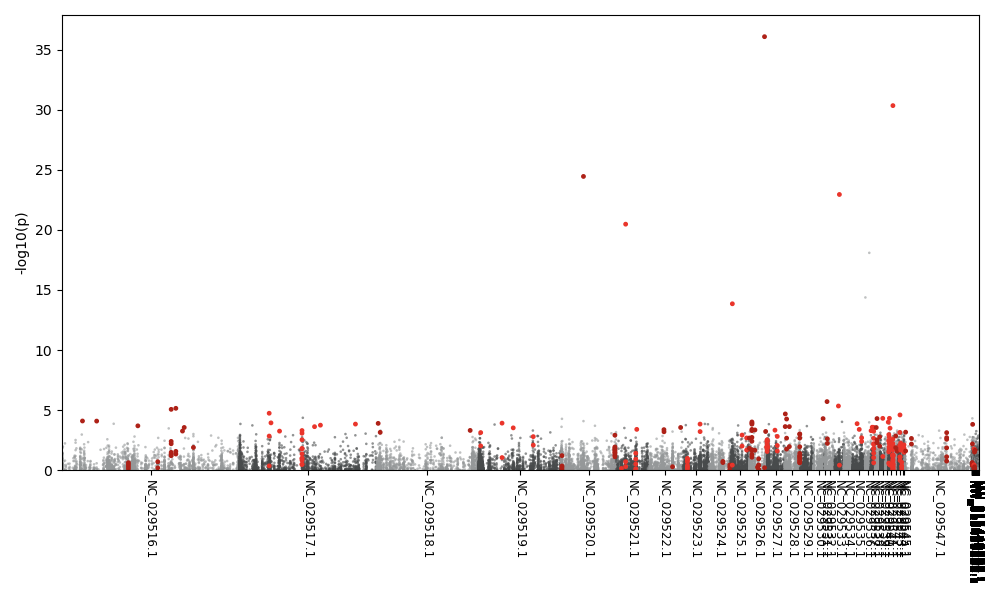
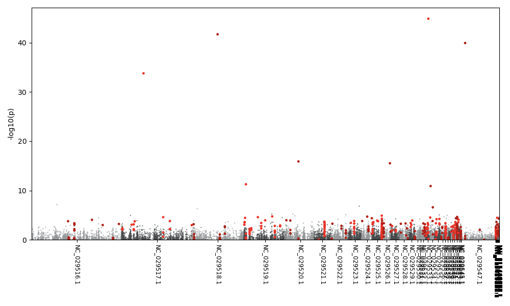
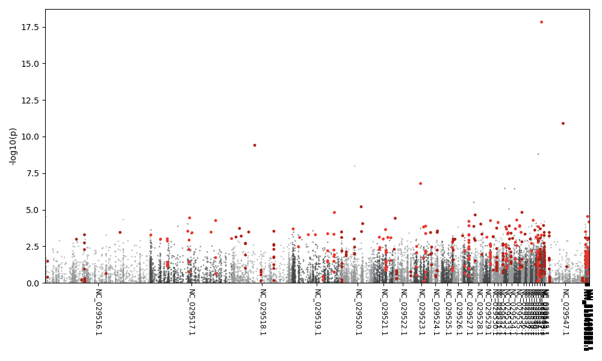
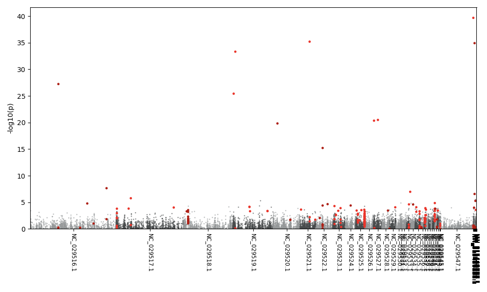
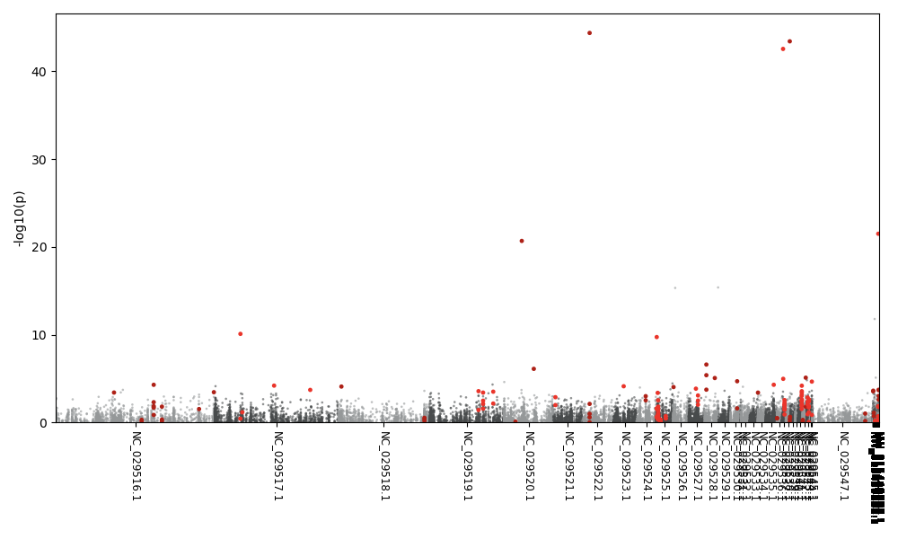
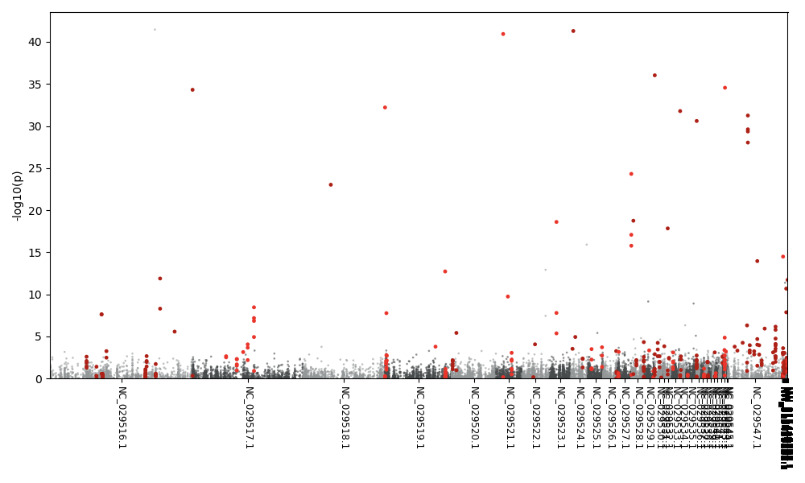
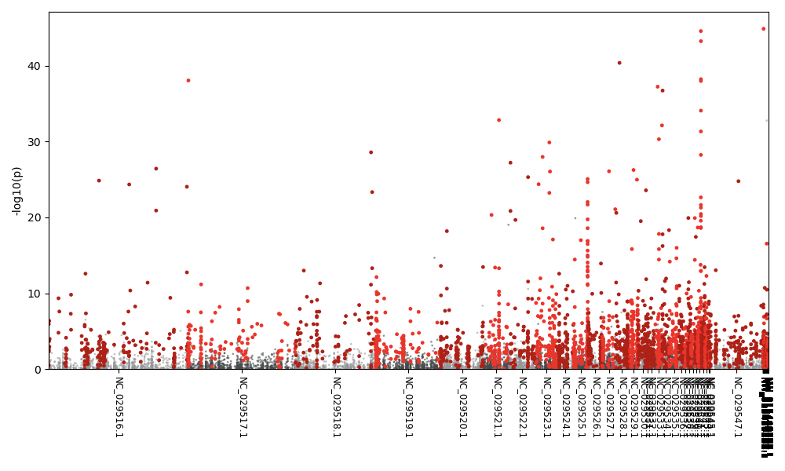

# p value correction 
With `FDR tool package` and `p.adjust`

see <https://www.ncbi.nlm.nih.gov/pmc/articles/PMC6099145/>

## combined-pvalues python package 
see <https://github.com/brentp/combined-pvalues>
and [comp-p folder](./combp) 
### Dependencies
Add missing `'`  in file setup.py, line 20, `long_description=open('README.rst'.read()`     
 
Recquire toolshed: `pip install toolshed`       
Recquire bedtools: installed with homebrew for easy install


#### python 3.7 
Don't work anymore with pyhton 2.7.    
Need to run  comb-p with a python version lower than 3.8: 
`sudo python3.7 setup.py install`   
(For some reasons, to run the results of pipeline 12, need to redo the installation with sudo)

### manhatthan plots for pipeline7 and 12
#### full model, female 
##### 7 weeks
 
##### 12 months


#### full model, male 
##### 7 weeks
 
##### 12 months


#### glyphosate model
##### 7 weeks
 

##### 12 months
 

#### sex model
##### 7 weeks
 

##### 12 months
 


### Make the pvalues lists as sorted bed files
Save the p values as a tab file in R, see [pipeline script](./pipeline.R):    
` write.table(pvalues, file = "pvalues.txt", sep = "\t", row.names = TRUE, col.names = FALSE)`


First, fix the chr names, then add a end columns, and sort. 
```
sed 's/"//g' pv_fullF.txt | awk '{sub(/\_/," ",$1)};1' |sed -E -e 's/^.{2}/&_/' | awk '{print $1,$2,$2+1, $3}' OFS="\t" | sort -k1,1 -k2,2n >../bed/ fF.bed 
```

Add header chrom/start/end/p-value mannually 

Run comb-p pipeline: 
`comb-p pipeline -c 4 --seed 0.05 --dist 300 -p S /Users/euphrasieservant/Desktop/combp/bed/S.bed`

In R, for each model save corrected p-value with comb-p >= 0.05, and keep the 3 first columns `chrom/start/end`:
```
fF.sites = fF_fdr[which(fF_fdr$`region-q`<=0.05),c(1,2,3)]
```
and save as a tab file
`write.table(fF.sites, file = "fF.sites.bed", sep = "\t", row.names = FALSE, col.names = FALSE)`

Don't forget to `sed -i '' 's/"//g' *.bed` before intersection. 

## Differently methylated sites per models and adjustments methods 

### pipeline 7 

| model       | FDR tool      |     p.adjust    |   comb-p   |   no corr | 
| ------------| ------------- | ---------       |---------   |---------  |
| FullF/FullM |        198    |      165        |F:315 M:474 |F:3115 M:2274
| Glyph       |        88     |      79         |254         | 2279
| Sex.        |        115    |      112        |380         | 1714


### pipeline 12 
| model       | FDR tool      |     p.adjust    |   comb-p   |   no corr | 
| ------------| ------------- | ---------       |---------   |---------  |
| FullF/FullM |        167    |      145        |F:318 M:458 |F:2507 M:3165
| Glyph       |        61     |      57         |186         | 2312
| Sex.        |        2730   |      2313       |3040        | 4947


