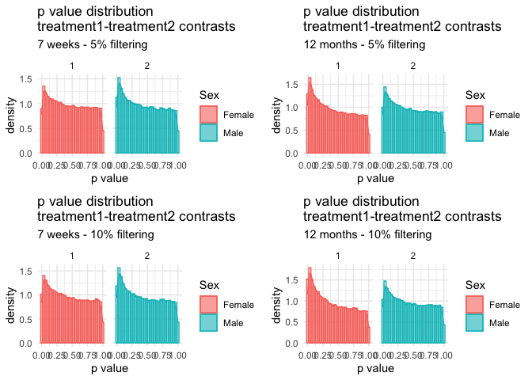

Lme4 - results
================
Euphrasie
6/9/2021

## filtering

#### sites with 5% difference in mean methylation

    ## [1] "85486 sites"

#### sites with 10% difference in mean methylation

    ## [1] "52592 sites"

## warnings

<table class="table table-striped table-hover table-condensed table-responsive" style="margin-left: auto; margin-right: auto;">
<thead>
<tr>
<th style="text-align:left;">
</th>
<th style="text-align:right;">
convergence
</th>
<th style="text-align:right;">
singular fit
</th>
<th style="text-align:right;">
unable to scale gradient
</th>
<th style="text-align:right;">
large eigen values
</th>
</tr>
</thead>
<tbody>
<tr>
<td style="text-align:left;">
7-5%
</td>
<td style="text-align:right;">
1385
</td>
<td style="text-align:right;">
1517
</td>
<td style="text-align:right;">
59
</td>
<td style="text-align:right;">
6
</td>
</tr>
<tr>
<td style="text-align:left;">
12-5%
</td>
<td style="text-align:right;">
1284
</td>
<td style="text-align:right;">
1430
</td>
<td style="text-align:right;">
62
</td>
<td style="text-align:right;">
1
</td>
</tr>
<tr>
<td style="text-align:left;">
7-10%
</td>
<td style="text-align:right;">
390
</td>
<td style="text-align:right;">
408
</td>
<td style="text-align:right;">
18
</td>
<td style="text-align:right;">
4
</td>
</tr>
<tr>
<td style="text-align:left;">
12-10%
</td>
<td style="text-align:right;">
340
</td>
<td style="text-align:right;">
398
</td>
<td style="text-align:right;">
22
</td>
<td style="text-align:right;">
0
</td>
</tr>
</tbody>
</table>

## p-values distribution

<!-- -->

## significant sites before combined-pvalues correction

<table class="table table-striped table-hover table-condensed table-responsive" style="margin-left: auto; margin-right: auto;">
<thead>
<tr>
<th style="text-align:left;">
</th>
<th style="text-align:right;">
7-5%
</th>
<th style="text-align:right;">
7-10%
</th>
<th style="text-align:right;">
12-5%
</th>
<th style="text-align:right;">
12-10%
</th>
</tr>
</thead>
<tbody>
<tr>
<td style="text-align:left;">
p-values&lt;0.05 in F
</td>
<td style="text-align:right;">
6216
</td>
<td style="text-align:right;">
4205
</td>
<td style="text-align:right;">
8179
</td>
<td style="text-align:right;">
5778
</td>
</tr>
<tr>
<td style="text-align:left;">
p-values&lt;0.05 in M
</td>
<td style="text-align:right;">
7347
</td>
<td style="text-align:right;">
4783
</td>
<td style="text-align:right;">
6769
</td>
<td style="text-align:right;">
4379
</td>
</tr>
<tr>
<td style="text-align:left;">
significant sites shared by F&M
</td>
<td style="text-align:right;">
612
</td>
<td style="text-align:right;">
409
</td>
<td style="text-align:right;">
712
</td>
<td style="text-align:right;">
522
</td>
</tr>
</tbody>
</table>

## significant sites with combined-pvalues correction

<table class="table table-striped table-hover table-condensed table-responsive" style="margin-left: auto; margin-right: auto;">
<thead>
<tr>
<th style="text-align:left;">
</th>
<th style="text-align:right;">
7-5%
</th>
<th style="text-align:right;">
7-10%
</th>
<th style="text-align:right;">
12-5%
</th>
<th style="text-align:right;">
12-10%
</th>
</tr>
</thead>
<tbody>
<tr>
<td style="text-align:left;">
p-values&lt;0.05 in F
</td>
<td style="text-align:right;">
521
</td>
<td style="text-align:right;">
1962
</td>
<td style="text-align:right;">
346
</td>
<td style="text-align:right;">
1160
</td>
</tr>
<tr>
<td style="text-align:left;">
p-values&lt;0.05 in M
</td>
<td style="text-align:right;">
749
</td>
<td style="text-align:right;">
938
</td>
<td style="text-align:right;">
541
</td>
<td style="text-align:right;">
585
</td>
</tr>
<tr>
<td style="text-align:left;">
significant sites shared by F&M
</td>
<td style="text-align:right;">
9
</td>
<td style="text-align:right;">
25
</td>
<td style="text-align:right;">
0
</td>
<td style="text-align:right;">
22
</td>
</tr>
</tbody>
</table>
