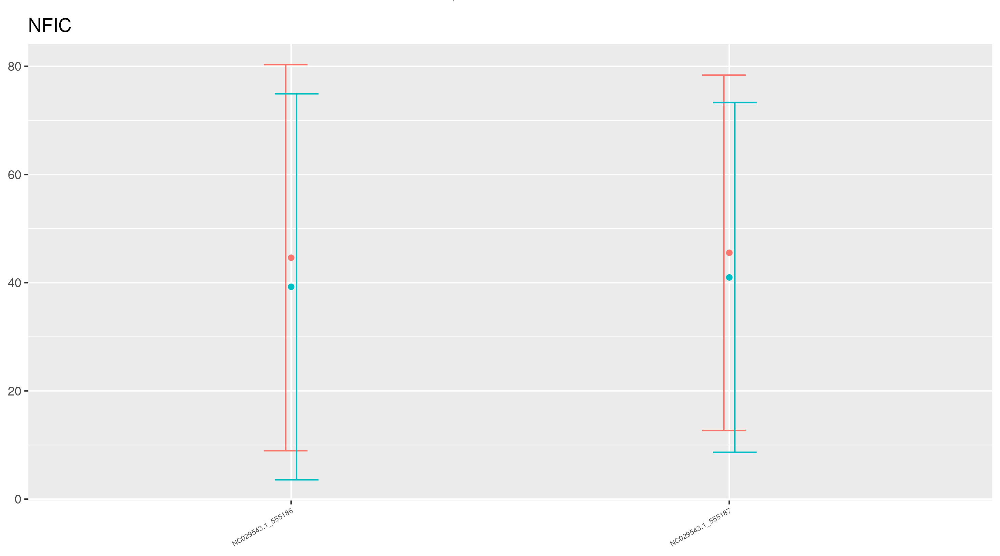

# Sites correction 
## p-value correction

Sites with no difference in methylation means seemed to have by mistake been labeled as significant sites, like the CpGs in the gene NFIC:   
 

Sites issued with convergence warnings have either a p-value = 0, and were removed in the pipeline, but others have just very low p-values that were not discared. 

Sites issued with warnings were then all discared. See [warningsites.rmd](warningsites.rmd) and [warning12.rmd](./warning12.rmd).

### combp 
see [comp-p folder](../combp) and   [comp-p2](./combp2) for results

#### 7 weeks
|   comb-p   | comb-p2|   no correction |
|---------   |---------  |--------|
|F:315 M:474 |F:136 M:53|F:3115 M:2274|

#### 12 months

|   comb-p   | comb-p2|   no correction |
|---------   |---------  |--------|
|F:318 M:458 |F:99 M:270|F:2507 M:3165|

## intersection 

**!!** GFF starts and ends are one-based.
In contrast, the GFF format uses 1-based coordinates for both the start and the end positions. bedtools is aware of this and adjusts the positions accordingly. In other words, you don’t need to subtract 1 from the start positions of your GFF features for them to work correctly with bedtools.

## enrichment analysis 
see gprofiler 

## compare 
see [goatools2](./goatools2) for results

