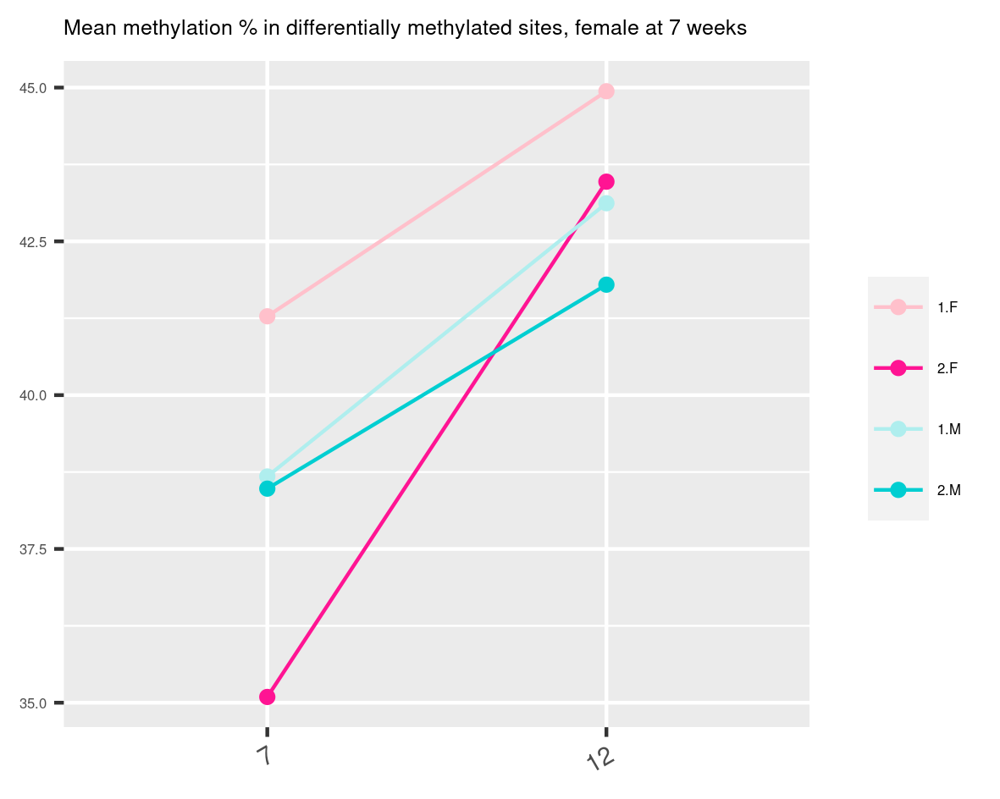
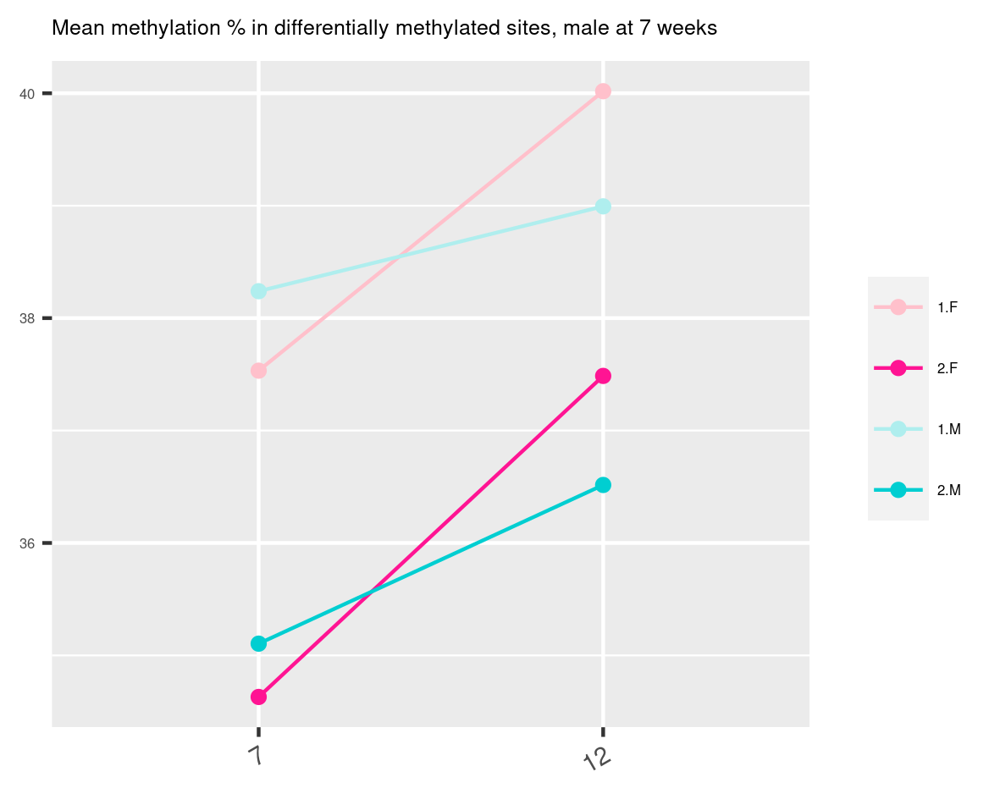
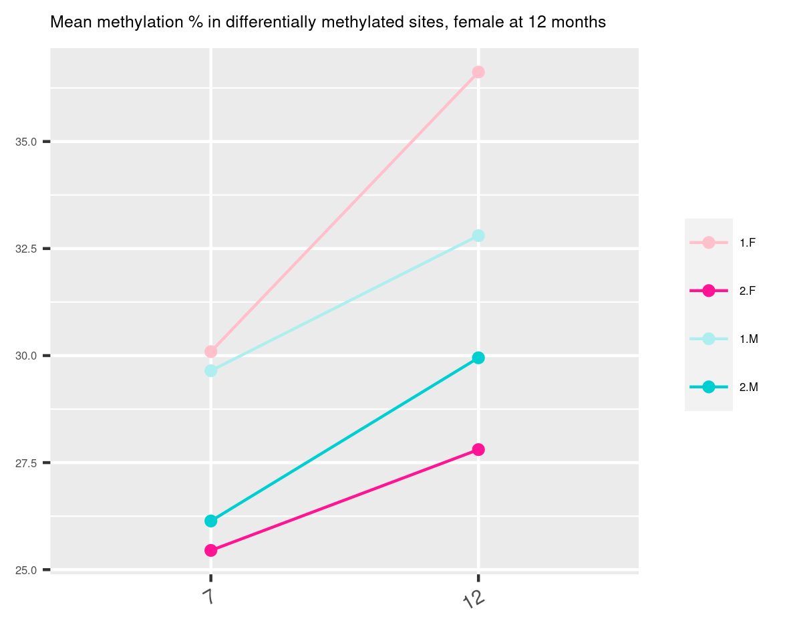
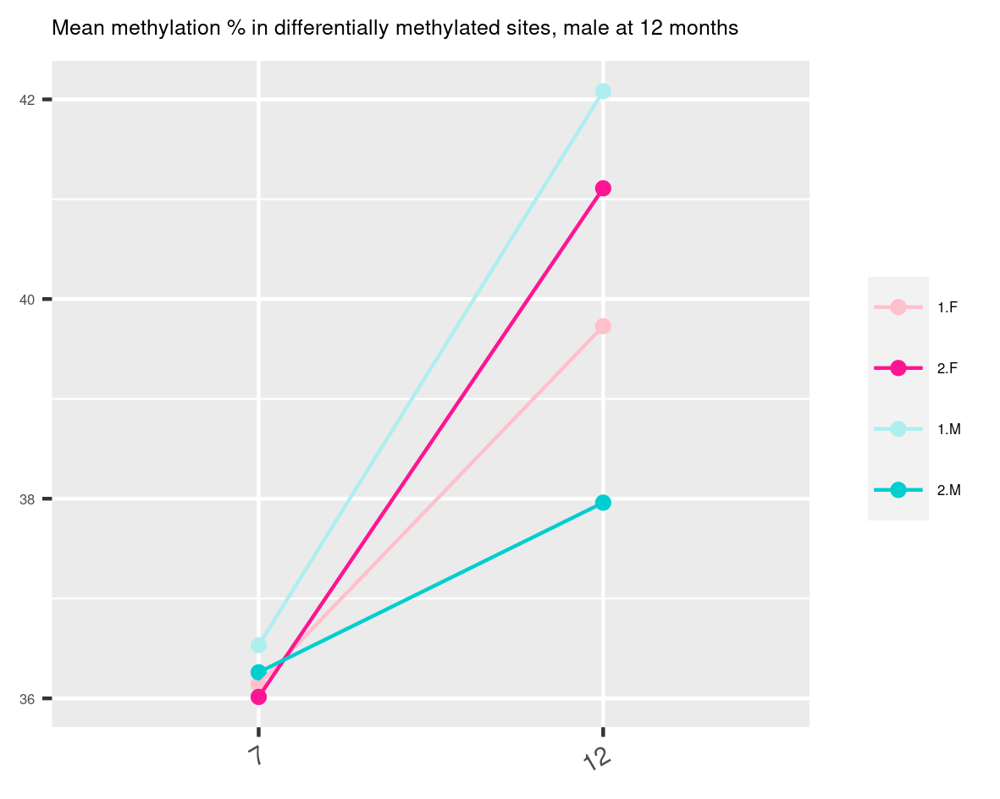
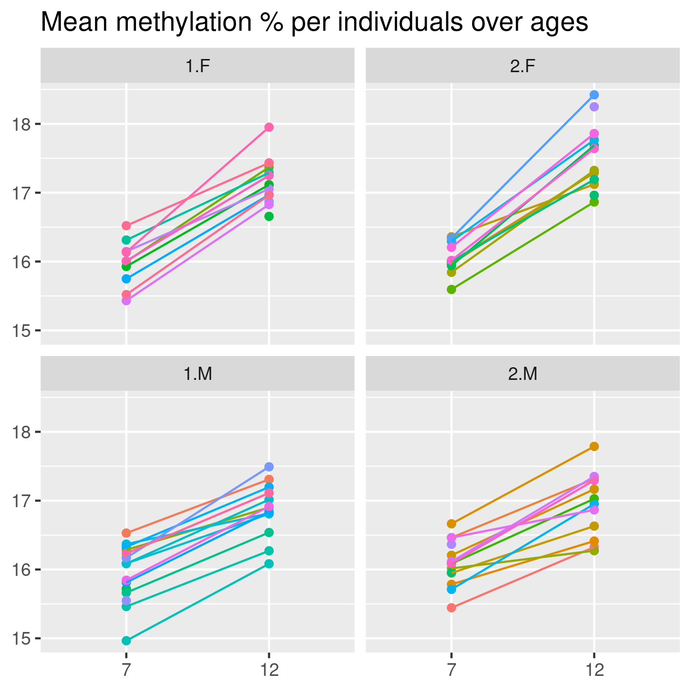

# some plots  

## differentially methylated sites in 7 weeks females

- differentially methylated sites in 7 weeks female seems to recovers at 12
- these sites seems not to be impacted for male 

## differentially methylated sites in 7 weeks males
 

- almost same absolute difference between 1.M/2.M and 1.F/2.F but we're looking at differentially methylated sites in male at 7 weeks
- These sites seems to be impacted the same way across conditions. 

## differentially methylated sites in 12 months females

- glyphosate at 12 months in female prevented some sites to be methylated?

## differentially methylated sites in 12 months males

 
- glyphosate at 12 months in male prevented some sites to be methylated? 

## mean methylation % over all sites
 

