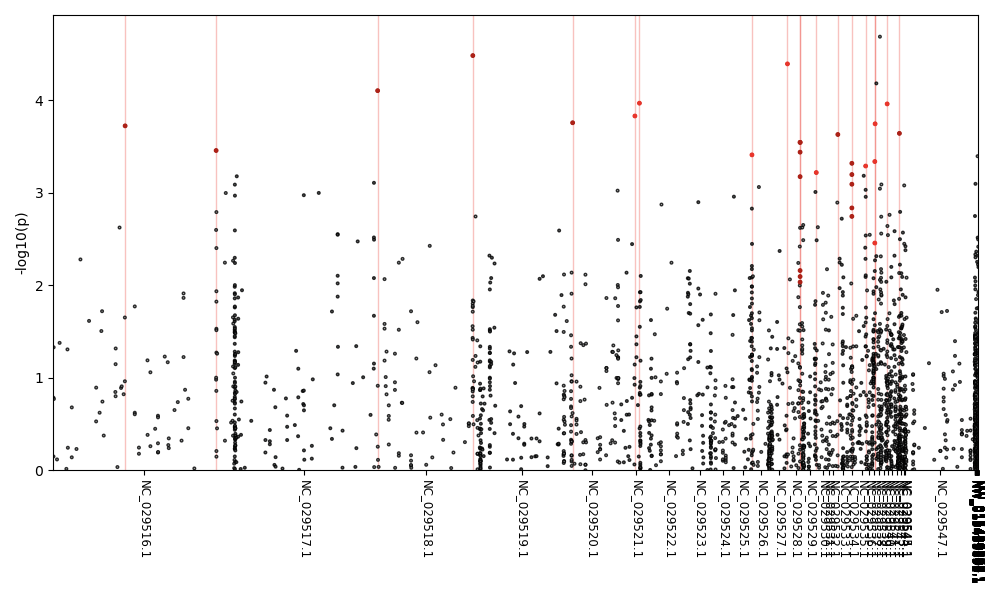
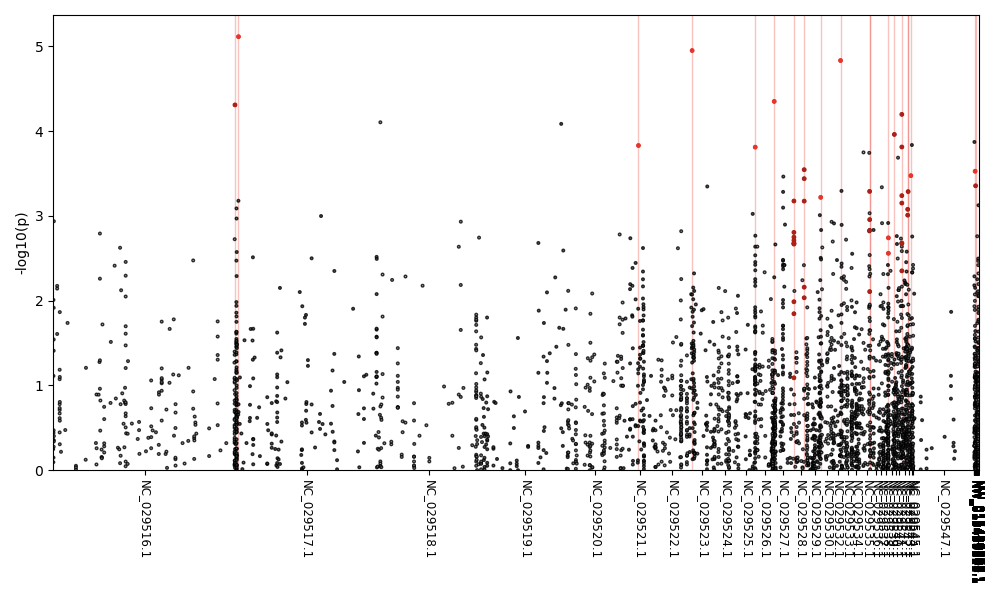
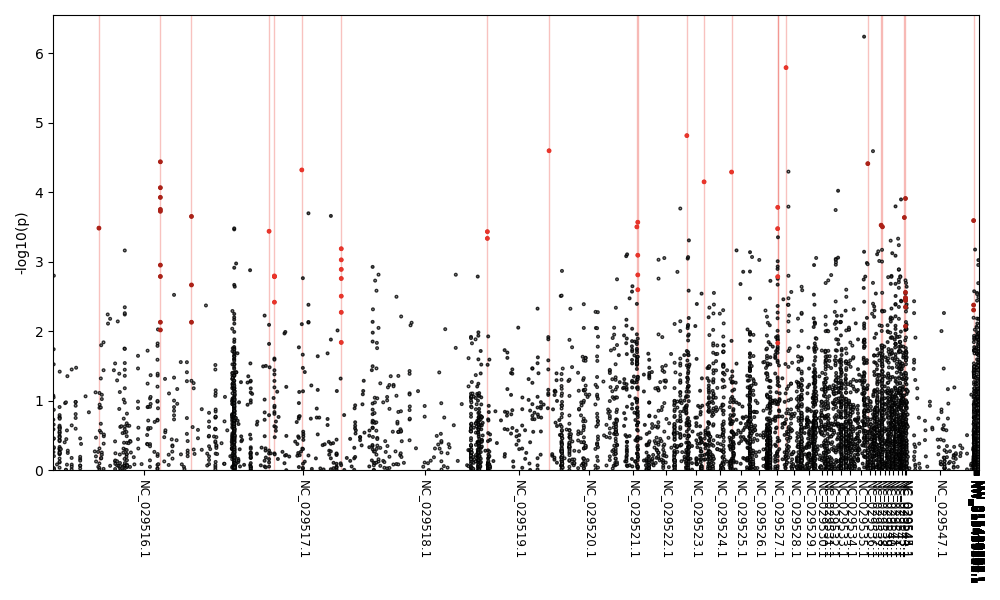
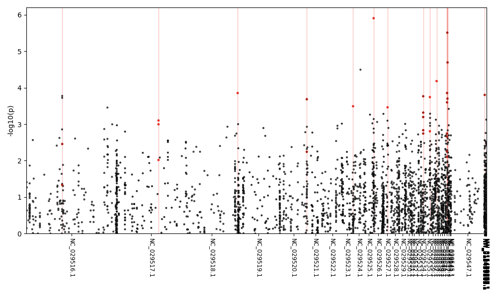
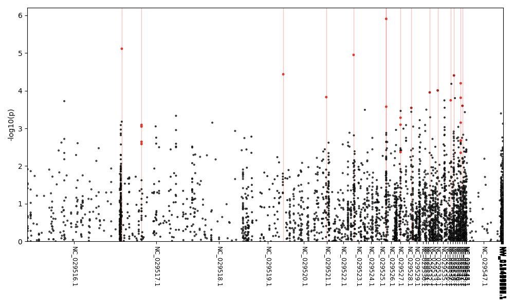
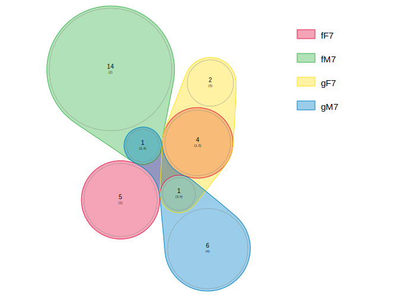
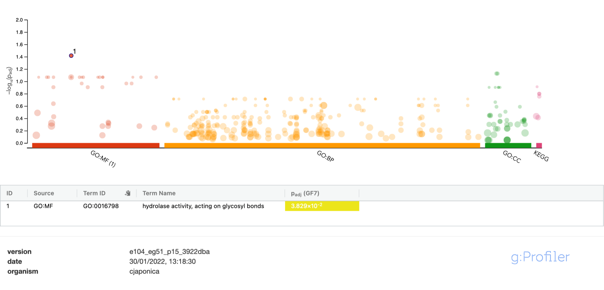
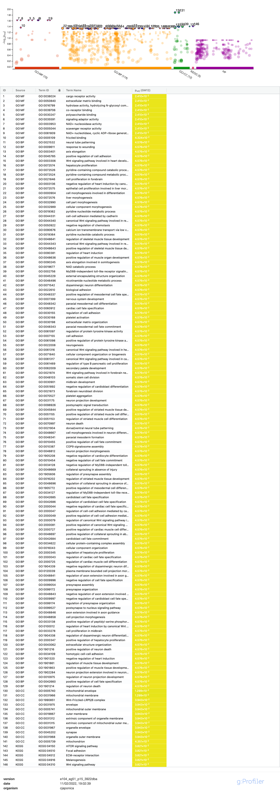
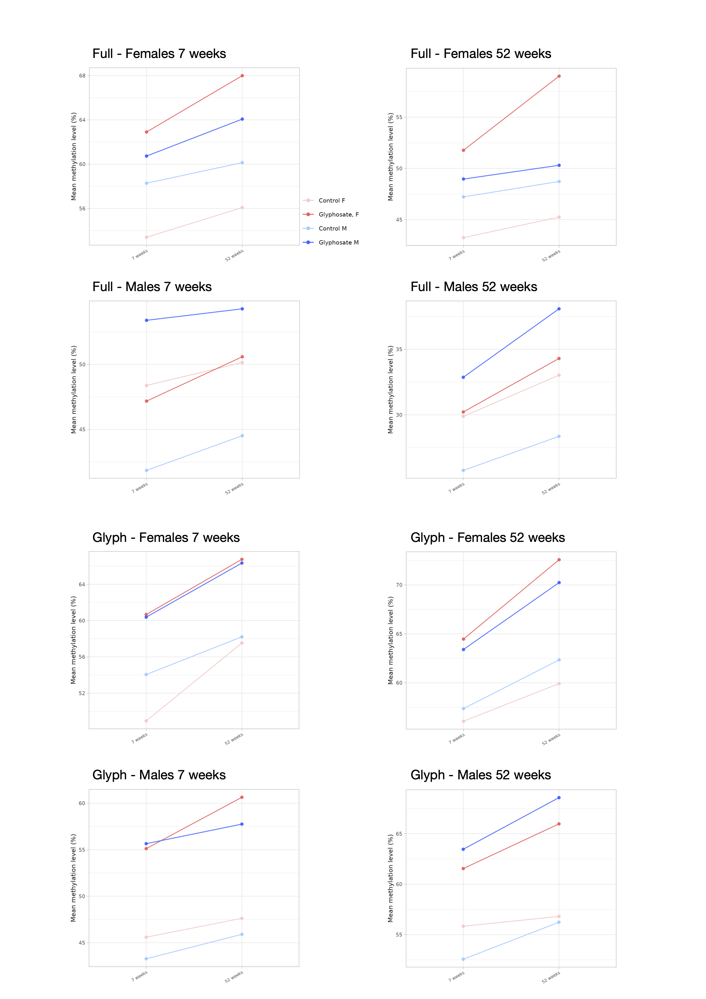

```{r setup, include=FALSE}
knitr::opts_chunk$set(echo = TRUE)
```
```{r load warning_rmd, include=FALSE}
load("./data/plot.RData")
load("./data/plot12.RData")
```
```{r sample, echo=FALSE}
library(knitr)
library(kableExtra)
```

## Filtering
See code [here](./script/09filtering.R).
Sites having a difference in their methylation level of at least 10% between control and GBH exposure inside each experimental groups (F7, M7, F12, M12) were kept.


## Pipeline 
See [pipeline 2](./script/pipeline2.R).
3 models were run at 7 and 52 weeks old.

### Full model
Same as before

```{r, eval=FALSE}
  full <-  relmatGlmer(cbind(sitetotest$meth_count,sitetotest$unmeth_count) 
                       ~ sex*cond + (1|ID12), data = sitetotest, 
                       relmat = list(ID12 = relatedness), 
                       family="binomial",
                       optimizer="bobyqa"
  )
```

### Glyph Effect 
This model was run independently on each sex groups. Sex is no longer a fixed effect.
```{r, eval=FALSE}
  GlyphEffect <-  relmatGlmer(cbind(sitetotestF7$meth_count,sitetotestF7$unmeth_count) 
                              ~ cond + (1|ID12), data = sitetotestF7,
                              relmat = list(ID12 = relatedness),
                              family="binomial",
                              optimizer="bobyqa"
  )
```

## Results
### warnings 
```{r, echo=FALSE}
matrixtobe = c(1,2,5,
               0,0,5,
               20,41,67,
               21,43,77)

table1 = matrix(matrixtobe, ncol = 3, byrow = TRUE)

colnames(table1)=c("Glyph F",
                  "Glyph M", 
                  "Full"
)

rownames(table1)=c("'?isSingular'","'unable to evaluate scaled gradient'", "'Model failed to converge","all")


matrixtobe2 = c(0,1,6,
               0,0,4,
               29,41,86,
               29,42,96)

table2 = matrix(matrixtobe2, ncol = 3, byrow = TRUE)

colnames(table2)=c("Glyph F",
                  "Glyph M", 
                  "Full"
)

rownames(table2)=c("'?isSingular'","'unable to evaluate scaled gradient'", "'Model failed to converge","all")


kable(table1, caption = "warnings, 7 weeks")
kable(table2, caption = "warnnings, 52 weeks")
  


```


### significant sites 
```{r, echo=FALSE}
matrixtobe3 = c(516,727,1942,
                495,684,1808)

table3 = matrix(matrixtobe3, ncol = 3, byrow = TRUE)

colnames(table3)=c("Glyph F",
                   "Glyph M", 
                   "Full"
)

rownames(table3)=c("sites with p.value < .05", "without sites issued warnings")
kable(table3, caption = "significant sites count, 7 weeks")

matrixtobe4 = c(835,801,2277,
                806,759,2246)

table4 = matrix(matrixtobe4, ncol = 3, byrow = TRUE)

colnames(table4)=c("Glyph F",
                   "Glyph M", 
                   "Full"
)

rownames(table4)=c("sites with p.value < .05", "without sites issued warnings")
kable(table4, caption = "significant sites count, 52 weeks")
```


#### p-value distribution
##### Full model
```{r, echo=FALSE, message=FALSE, warning=FALSE}
library(ggplot2)
library("gridExtra")
grid.arrange(full_pval.plot + ggtitle("7 weeks"), full_pval.plot12 + ggtitle("52 weeks"), ncol = 2)
```

##### Glyph model
###### females
```{r, echo=FALSE, message=FALSE, warning=FALSE}
library(ggplot2)
library("gridExtra")
grid.arrange(glyphF_pval.plot + ggtitle("7 weeks"), glyphF_pval.plot12 + ggtitle("52 weeks"), ncol = 2)
```

###### males
```{r, echo=FALSE, message=FALSE, warning=FALSE}
library(ggplot2)
library("gridExtra")
grid.arrange(glyphM_pval.plot + ggtitle("7 weeks"), glyphM_pval.plot12 + ggtitle("52 weeks"), ncol = 2)
```


## p value correction with comb-p

### manhattan plots 
#### 7 weeks
##### Full model
###### Females, 36 sites


######  Males, 80 sites


##### Glyph model
###### Females, 29 site



###### Males, 43 site


#### 52 weeks
##### Full model
###### Females, 137 sites


######  Males, 56 sites


##### Glyph model
###### Females, 30 site



###### Males, 25 site


## Differentially  methylated sites in promoters 
Promoters were defined as the regions from 3000 upstream to 300 downstream of the TSS.

```{r, echo=FALSE}
matrixtobe5 = c(17,29,10,10,
                67,27,12,6)

table5 = matrix(matrixtobe5, ncol = 4, byrow = TRUE)

colnames(table5)=c("Full F",
                   "Full M", 
                   "Glyph F",
                   "Glyph M"
)

rownames(table5)=c("7 weeks", "12 weeks")
kable(table5, caption = "Differentially methylated sites in promoters")

```

## Genes 
Coordinates of differentially methylated sites were crossed with Japanese quail's GFF3 to retrieve differentially methylated sites in promoters and their genes' ids. 

### Venn diagramms: Genes ID repartition in differentially methylated sites in promoters
#### All models, 7 weeks



#### All models, 52 weeks 


#### Full model, all ages


#### Glyph model, all ages


## Enrichment analysis
### Full model 
#### 7 weeks

#### 52 weeks 


### Glyph model 
#### 7 weeks
##### Females


##### Males


####  52 weeks
##### Females


##### Males 52 weeks


### GOs comparison
see [table here](./table/compare_all_tred.pdf).


## Some stats 



