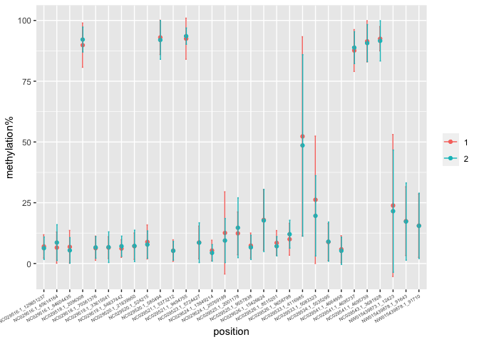
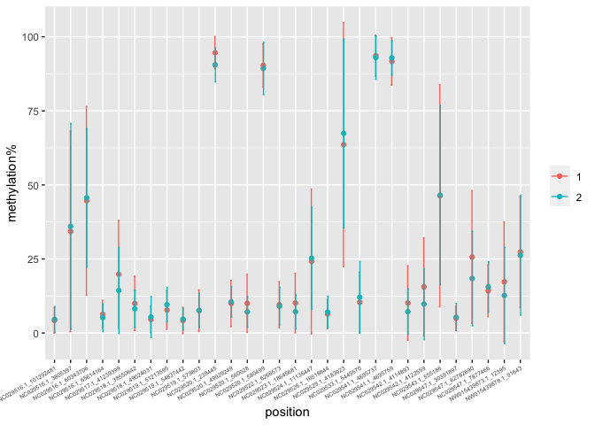
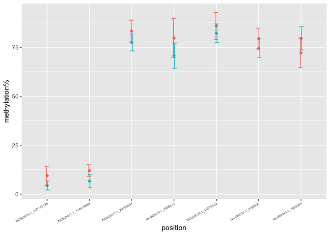
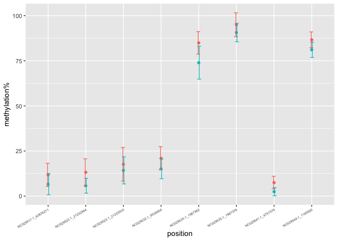

warning sites 12
================
Euphrasie
5/12/2021

## 12 months old

530 sites have been issued warning, out of the 22343 sites tested.

### “convergence” warnings

306 warnings of this type:
`"Model failed to converge with max|grad| = 0.0216091 (tol = 0.002, component 1)"`.

#### female

30 of these sites were kept through the analysis.

<!-- -->

#### male

30 of these sites were kept through the analysis.
<!-- -->

### “singular” warnings

206 warnings of this type: `"boundary (singular) fit: see ?isSingular"`.

#### female

7 of these sites were kept through the analysis

<!-- -->

#### male

8 of these sites were kept through the analysis
<!-- -->

### “unable” warnings

17 of this type: `"unable to evaluate scaled gradient"`.

#### female

All of these sites were discarded.

#### male

All of these sites were discarded.
