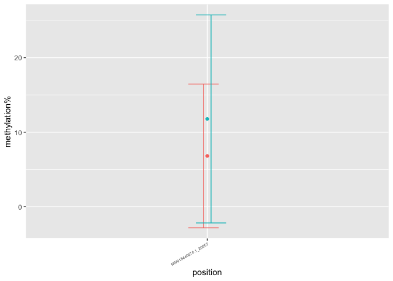

warning sites
================
Euphrasie
5/12/2021

## 7 weeks old

503 sites have been issued warning, out of the 22343 sites tested.

### “convergence” warnings

301 warnings of this type:
`"Model failed to converge with max|grad| = 0.0216091 (tol = 0.002, component 1)"`.

#### female

39 of these sites were kept through the analysis.

<!-- -->

#### male

76 of these sites were kept through the analysis.
<!-- -->

### “singular” warnings

188 warnings of this type: `"boundary (singular) fit: see ?isSingular"`.

#### female

No sites were discarded.

<!-- -->

#### male

No sites were discarded.
<!-- -->

### “unable” warnings

of this type: `"unable to evaluate scaled gradient"`. \#\#\#\# female
All of these sites were discarded.

#### male

1 sites was kept.
<!-- -->
